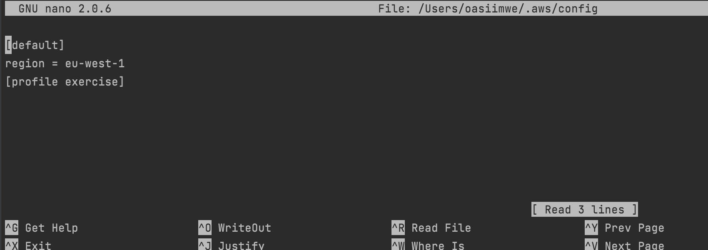
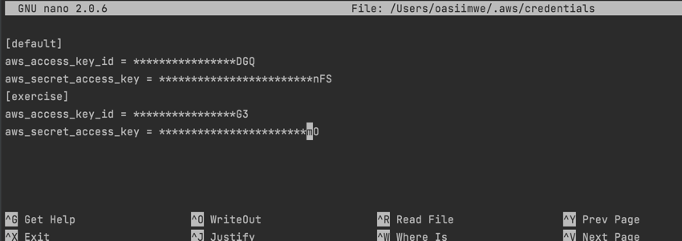

# NN CMC BDS Data Engineering Exercise

Welcome to our data engineering exercise, we're delighted that you decided to apply for a job with us. We'll be using your solution as basis of discussion when we get to meet you on your first interview. Below, you'll find an explanation for the exercise. You are free to write the solution to this exercise either as code, or in plain text/pseudo-code (the more detailed and clear, the better).

**Time of delivery** 24 hours before your interview starts.

We wish you the best of luck!

# Getting Started

You're asked to fork this repository. When you do, we'll be notified. At the end of the time you're given to complete this exercise, we'll have a look at your fork, meaning you don't need to send us anything (except for an optional task in **Exercise 2**). Reach out to Diogo on +45 30 75 55 50 should you have any questions. Don't forget you need the **AWS access keys** provided to you by email.

# Exercise 0

+ Install the [aws-cli-v2](https://docs.aws.amazon.com/cli/latest/userguide/getting-started-install.html) (recommended kernel: linux)
+ Configure a profile `exercise` with the **AWS access keys** provided to you by email

You can verify your installation and configuration with the expected output:

```shell
aws s3 ls --profile exercise

An error occurred (AccessDenied) when calling the ListBuckets operation: Access Denied

aws s3 ls s3://cmc-bds-de --profile exercise
    PRE wishes/

aws s3 cp s3://cmc-bds-de/wishes/you/good/luck.parquet data.parquet --profile exercise
download: s3://cmc-bds-de/wishes/you/good/luck.parquet to ./data.parquet
```

TODO:
+ **exercise** Explain how you configured the aws profile indicating the path and the contents of the configuration and the credentials files.
    + **solution** your-solution-here (commit `README.md` to the `exercise_0` branch)
      + I installed aws cli v2 following the instructions in the link shared above.
      + In order to configure aws profile "exercise" I used ```aws configure --profile exercise``` passing the **AWS Access Key ID** and the **AWS Secret Access Key** shared in the email.
      + My aws profile configuration and  credentials profiles are located at the paths below:
        + ```~/.aws/config```
          + 
        + ```~/.aws/credentials``` (the credentials in the screenshot below have been redacted)
          + 

# Exercise 1

Fork this repo. Your fork should include the following branching strategy:

```txt
main
│
└╴tst
  │
  └╴dev
    │
    ├╴ exercise_0
    ├╴ exercise_1
    ├╴ exercise_2
    └╴ exercise_3
```

TODO:
+ **exercise** commit the work on `exercise_x` to the `exercise_x` branch (Example: commit changes to `exercise_2` to the branch `exercise_2`)
+ **exercise** At the end of each exercise `exercise_x`:
    + issue a PR from `exercise_x` to `dev`, approve it
    + issue a PR from `dev` to `tst`, approve it
    + issue a PR from `tst` to `main`, approve it
+ branch `exercise_x` further should you find it fit
+ **exercise** why are git branching strategies important?
    + **solution**: your-answer-here (commit `README.md` to the `exercise_1` branch)


# Exercise 2

You're asked to build and publish a python package to a public package index ([pypi](https://pypi.org/)). The package should include a class `Ops` and two methods `remove_null_values`, `rotate` such that the script `exercise_3/exercise_3.py` compiles and executes as expected. The commands you use to build and publish the package go to the script `exercise_2/azure-pipelines.yml`. This CICD pipeline script will encapsulate the logic for the following devops steps:
- linting
- unit testing
- building
- publishing

TODO
+ **exercise** add the cmds for the steps above in the corresponding steps in `exercise_2/{your_package_name}/azure-pipelines.yml`
+ **exercise** `exercise_2/{your_package_name}/setup.py`
+ **exercise** hide your pypi credentials `exercise_2/{your_package_name}/.pypirc`.
+ **exercise** include all the dependencies you see fit in `exercise_2/{your_package_name}/requirements.txt`.
+ **exercise** Create your own package in `exercise_2/{your_package_name}`, but `exercise_3/exercise_3.py` **should** import from [pypi](https://pypi.org/), not from `exercise_2/{your_package_name}`. If you can't publish the package to Pypi, import it locally. You will need it for the **Exercise 3**.
+ **exercise** include unit tests in `exercise_2/{your_package_name}/test` with whatever unit tests you might find suiting. Make sure the tests are passing.
+ **exercise** include pydocs in the module, class and methods
+ **exercise** lint the code
+ **optional** setup a CICD pipeline automating all these steps (you can opt by any other pipelines provider, please send us an url to the pipeline if you choose to do it).

# Exercise 3

TODO:
+ **exercise** complete `exercise_3/exercise_3.py` (`read_parquet` and `write_parquet`) such that it writes the expected result to our S3 bucket.
+ **exercise** lint `exercise_3/exercise_3.py`
+ **optional** add unit tests to `exercise_3/exercise_3.py`
